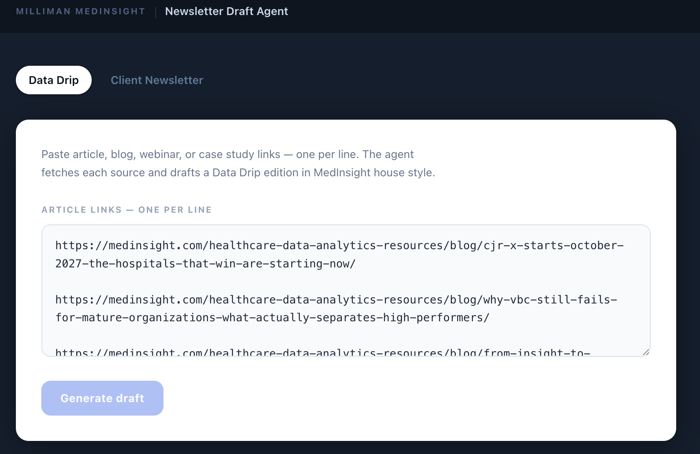
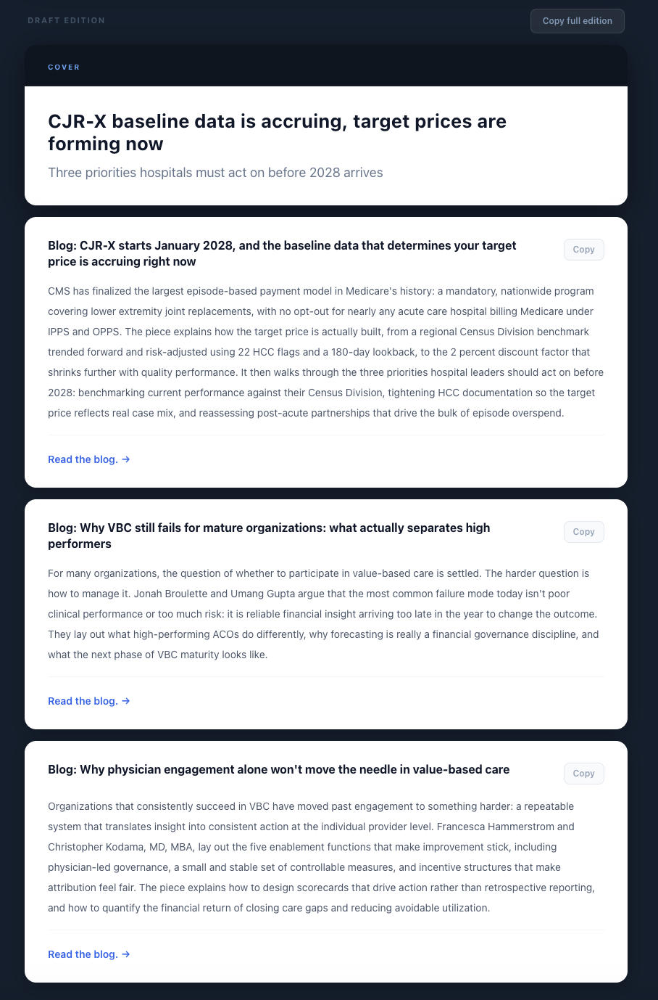
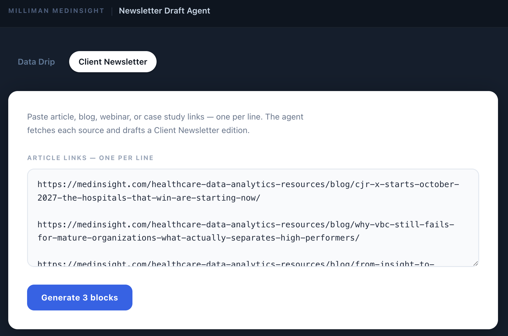
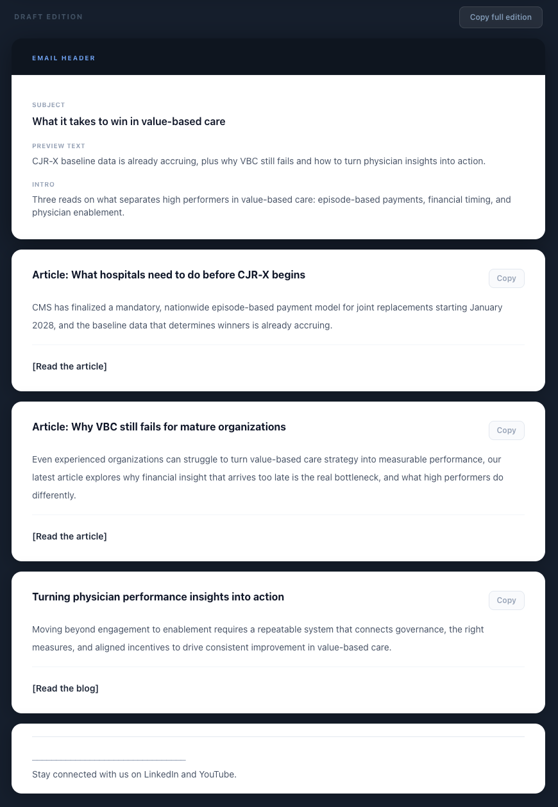

# MedInsight Newsletter Agent

An internal tool that drafts Milliman MedInsight's newsletters in the team's own house voice. Paste the source links for an edition, and the agent fetches each article, reads it, and generates a ready-to-review draft: a LinkedIn "Data Drip" newsletter or a client email newsletter, each in its correct format.

Built with Next.js and the Claude API during my Growth Internship on the MedInsight marketing team, to systematize newsletter drafting, a task I owned manually over the summer.

**Live app:** https://medinsight-newsletter-agent.vercel.app
**Walkthrough:** _Loom link here_

---

## What it does

The marketing team publishes two newsletters. Both start the same way: someone gathers a handful of links (a blog, a webinar, a case study, an event) and turns them into a formatted edition. This tool automates the drafting.

You paste the links. For each one, the app fetches the page, extracts the readable article text, and uses Claude to write one story block in the correct house voice. It assembles the blocks into a full draft you review, edit, and ship. The person stays in control; the repetitive drafting disappears.

### Two modes, two real formats

**Data Drip (LinkedIn newsletter):** cover headline and subhead, then rich story blocks. Each block leads with the stakes, names the real MedInsight experts from the source, and ends with a short linked CTA.





**Client Newsletter (email):** a lighter, scannable format. Subject line, preview text, and intro, then short blocks with a one-line value prop and an action CTA, closing with the standard footer.





Each format is driven by real past editions used as voice references, so the output matches how each newsletter actually reads.

---

## How it works

```
Paste links
  -> server fetches each URL and extracts readable article text
  -> Claude drafts each block using past editions as voice references
  -> blocks assembled into a full edition
  -> review, copy, and ship
```

1. **Link fetching and extraction.** A server route pulls each page and strips navigation, ads, and footers down to the article text.
2. **Voice-referenced generation.** The extracted text plus real past editions go to Claude, so the draft matches MedInsight's house voice instead of reading like generic AI.
3. **Format control.** Each tab loads only its own examples and format rules, so Data Drip and the client email stay distinct.
4. **Structured output.** Claude returns each block as structured data (header, body, CTA) that the app renders and lets you copy per block or as a full edition.

---

## Tech stack

- **Next.js (App Router) + TypeScript** — app and server routes
- **Claude API** — draft generation, with real editions as voice references
- **Server-side fetching + HTML-to-text extraction** — turns a URL into clean article text
- **Tailwind CSS** — interface
- **Vercel** — hosting

---

## Design notes

- **Human in the loop by design.** The agent drafts. It never auto-posts. A person reviews and ships every edition.
- **Voice comes from real examples, not a clever prompt.** Output quality tracks the quality of the reference editions loaded for each format.
- **No private data.** The tool runs on public article links. No confidential company data is stored or hardcoded.

---

## Running locally

```bash
npm install
# add your key to .env.local:
#   ANTHROPIC_API_KEY=sk-ant-...
npm run dev
```

Then open http://localhost:3000

---

Built by Akshay Iyer.
